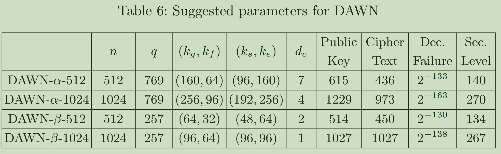

## Hashing profile
1. keygen: 18%, enc: 32%, dec: 10%

## profile on Intel CPU: 
Each sample counts as 0.01 seconds.
  %   cumulative   self              self     total           
 time   seconds   seconds    calls  us/call  us/call  name    
 26.10      1.36     1.36 12800512     0.11     0.11  base_inv
 16.12      2.20     0.84   100001     8.40    12.23  PKE_Decrypt
 15.16      2.99     0.79  2500056     0.32     0.32  KeccakF1600_StatePermute
  9.21      3.47     0.48   400008     1.20     1.20  mq_poly_ntt
  6.33      3.80     0.33   300004     1.10     1.10  mq_poly_intt
  4.03      4.01     0.21   300004     0.70     0.83  mq_poly_pointwise_mul
  3.07      4.17     0.16   100004     1.60     3.20  FastInversion
  2.88      4.32     0.15   100004     1.50     1.50  mq_poly_ntt_mq
  2.50      4.45     0.13   200003     0.65     0.65  decode_pk
  2.30      4.57     0.12   100004     1.20     1.90  mq_poly_pointwise_mul_mq
  2.11      4.68     0.11   600024     0.18     0.18  Mul_in_R2_n
  1.92      4.78     0.10   200003     0.50     1.69  ternary_sample_se
  1.34      4.85     0.07  6400256     0.01     0.01  base_mul_mq
  1.34      4.92     0.07   100001     0.70     0.70  decode_ct
  0.96      4.97     0.05   600024     0.08     0.08  Mulf_in_R2_N2
  0.96      5.02     0.05   200003     0.25     5.59  PKE_Encrypt
  0.77      5.06     0.04 19200256     0.00     0.00  base_mul
  0.77      5.10     0.04   200003     0.20     0.20  encode_ct
  0.58      5.13     0.03   100004     0.30     1.81  ternary_sample_fgk
  0.19      5.14     0.01   400009     0.02     0.66  sha3_256
  0.19      5.15     0.01   300007     0.03     1.19  shake256_squeezeblocks
  0.19      5.16     0.01   200008     0.05     0.05  check_poly_inv_Zq
  0.19      5.17     0.01   200003     0.05     0.37  sha3_512
  0.19      5.18     0.01   100004     0.10    23.72  PKE_KeyGen
  0.19      5.19     0.01   100004     0.10     0.10  encode_f
  0.19      5.20     0.01   100004     0.10     0.10  encode_pk
  0.19      5.21     0.01   100001     0.10     0.10  decode_f
  0.00      5.21     0.00   300007     0.00     0.32  shake256_absorb_once
  0.00      5.21     0.00   200003     0.00     0.00  poly_round
  0.00      5.21     0.00   100004     0.00    24.58  KEM_KeyGen
  0.00      5.21     0.00   100004     0.00     0.00  check_poly_inv_Z2
  0.00      5.21     0.00   100004     0.00    13.60  mq_poly_inv_ntt
  0.00      5.21     0.00   100004     0.00     0.32  shake256_squeeze
  0.00      5.21     0.00   100002     0.00     7.92  KEM_Enc
  0.00      5.21     0.00   100001     0.00    19.60  KEM_Dec

## AI profiling

The main cost in `PKE_Decrypt()` is the polynomial multiply path at [pke.c](/home/hjh/Documents/project/pqm4/crypto_kem/dawn-b-1024/ref/pke.c:257):

- [pke.c:264](/home/hjh/Documents/project/pqm4/crypto_kem/dawn-b-1024/ref/pke.c:264) `mq_poly_ntt(tmp1)`
- [pke.c:265](/home/hjh/Documents/project/pqm4/crypto_kem/dawn-b-1024/ref/pke.c:265) `mq_poly_pointwise_mul(tmp2, tmp1, f)`
- [pke.c:266](/home/hjh/Documents/project/pqm4/crypto_kem/dawn-b-1024/ref/pke.c:266) `mq_poly_intt(tmp2)`

Those three calls are the decryption hotspot by a wide margin.

Why they dominate:
- `mq_poly_ntt()` does 7 NTT stages over `DIM_N = 1024`, with one modular multiply per butterfly: about 3584 `fqmul()` calls. See [mq_ntt.c:25]( /home/hjh/Documents/project/pqm4/crypto_kem/dawn-b-1024/ref/mq_ntt.c:25 ).
- `mq_poly_pointwise_mul()` is especially expensive. It calls `base_mul()` 128 times, and each `base_mul()` performs many `fqmul()` operations. See [mq_ntt.c:183]( /home/hjh/Documents/project/pqm4/crypto_kem/dawn-b-1024/ref/mq_ntt.c:183 ) and [mq_ntt.c:100]( /home/hjh/Documents/project/pqm4/crypto_kem/dawn-b-1024/ref/mq_ntt.c:100 ). This is likely the single heaviest step inside decryption.
- `mq_poly_intt()` does another full inverse transform plus final scaling, about 4608 more `fqmul()` calls. See [mq_ntt.c:73]( /home/hjh/Documents/project/pqm4/crypto_kem/dawn-b-1024/ref/mq_ntt.c:73 ).

The next most relevant decryption costs are:

- [pke.c:262](/home/hjh/Documents/project/pqm4/crypto_kem/dawn-b-1024/ref/pke.c:262) `decode_pk(c, tmp1)`  
  `decode_pk()` has a lot of packing/unpacking plus many `%` and `/` operations by `86` and `3`; on embedded targets those divisions can be relatively costly. See [code.c:125]( /home/hjh/Documents/project/pqm4/crypto_kem/dawn-b-1024/ref/code.c:125 ).
- [pke.c:268](/home/hjh/Documents/project/pqm4/crypto_kem/dawn-b-1024/ref/pke.c:268 ) to [pke.c:276]( /home/hjh/Documents/project/pqm4/crypto_kem/dawn-b-1024/ref/pke.c:276 )  
  Two 512-iteration loops with `montgomery_reduce()`. Noticeable, but still much smaller than the NTT/multiply/INTT block.
- [pke.c:293](/home/hjh/Documents/project/pqm4/crypto_kem/dawn-b-1024/ref/pke.c:293) `Mul_in_R2_n(tmp2, tmp_f2, N, mp)`  
  This can become fairly heavy because it scans for `1` bits and then XORs length-512 vectors repeatedly. See [pke.c:39]( /home/hjh/Documents/project/pqm4/crypto_kem/dawn-b-1024/ref/pke.c:39 ). It is memory/XOR heavy, but still usually secondary to the modular-arithmetic block.

Within all of `pke.c`, the slowest routines overall are:
- `PKE_KeyGen()` first, because of repeated rejection loops plus [pke.c:194]( /home/hjh/Documents/project/pqm4/crypto_kem/dawn-b-1024/ref/pke.c:194 ) `mq_poly_inv_ntt()` and [pke.c:196]( /home/hjh/Documents/project/pqm4/crypto_kem/dawn-b-1024/ref/pke.c:196 ) `FastInversion()`.
- `PKE_Decrypt()` next, dominated by lines 264 to 266.
- `PKE_Encrypt()` after that, with the same NTT/mul/INTT structure but less extra work.

If you want the short answer for decryption: focus on line `265` first, then `264` and `266`, then `decode_pk()`, then `Mul_in_R2_n()`.

## TODO optimizations
1. hash for reference and m4 should be different? to highlight the Keccak optimization by our paper. -- On embedded/board builds, pqm4 currently uses common/keccakf1600.S via mk/crypto.mk (line 6), not the C file. change this mk file to use .c version keccak.
2. 1024 version of KEM is wrong. kem_dec: pke_decrypt cannot end. try to not use 512 version of KEM, and self-create one.: the problem is that sk->f2 is modifed in PKE_Decrypt, which is quite strange. randombytes should also be deleted to use randombytes in pqm4. 

3. NTT, basemul, INTT. OK!
4. fastinversion in R2.
5. Mul_in_R2_n is the ripest target.
It scans for set bits and then XORs full shifted vectors in nested loops in pke.c (line 25). Since this is binary arithmetic, a packed uint32_t or assembly bitset version should help much more than micro-tuning the current int16_t code.
6. Fuse the cp build with reduction.
Right now decryption does:
build cp with two passes at pke.c (line 264)
then run mq_poly_reduce(cp, DIM_N) (line 273)
That is an extra full memory pass. A combined “add/sub + reduce” kernel would cut traffic.
Merge the parity-extraction passes after reduction.
After cp is reduced, you make separate passes for:
tmp2[i] = (cp[i] & 1) ^ (cp[i + N] & 1) (line 275)
ep[i] = ... (line 292)
These can be merged into one 128-iteration pass.

01010101 101010 11110000 1